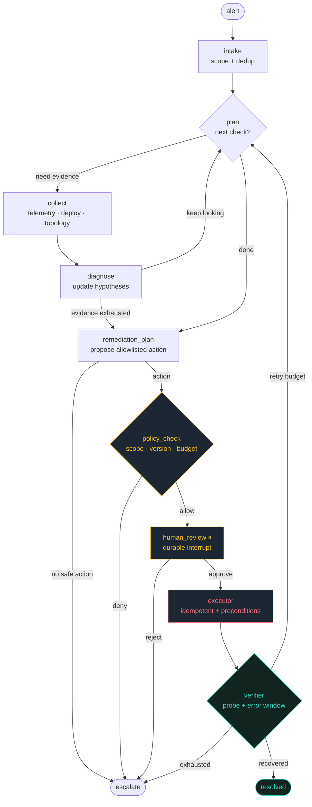

# claude-contract-agent

[](https://github.com/niteshnankani-svg/claude-contract-agent/actions/workflows/ci.yml)
[](LICENSE)
[](https://www.python.org/)
[](https://github.com/langchain-ai/langgraph)
[](tests/test_graph.py)
[](https://claude-contract-agent.vercel.app)

A **LangGraph incident investigation & controlled remediation agent** for
Kubernetes-based applications. It takes an alert, gathers bounded evidence,
reasons over a hypothesis ledger, proposes a scoped remediation, **pauses for
human approval**, applies the change idempotently, and **verifies real recovery
with an application-level probe** — restoring service instead of just diagnosing
it.

Built directly from the decision brief in
[`AGENT_MARKET_RESEARCH.md`](AGENT_MARKET_RESEARCH.md), which recommended this
project (over the order/invoice-exception alternatives) as the strongest
demonstration of applied agent engineering.

> **Status:** working reference implementation + evaluation harness on a
> *simulated* fault-injected cluster. It is not a validated product. See
> [`docs/DESIGN.md`](docs/DESIGN.md) → "What this is not".

## Live demo

An interactive, animated walkthrough of the agent's incident run — built with
**Vite + React + TypeScript, Tailwind CSS and Framer Motion** and deployed on
**Vercel**. Drive the run yourself, approve or reject the remediation at the
human-review gate, and watch recovery get verified.

> 🔗 **Live:** **https://claude-contract-agent.vercel.app** &nbsp;·&nbsp; source in [`web/`](web/)

## Why these choices

- **Framework — LangGraph.** The hiring evidence in the brief repeatedly names
  typed state, checkpointing, replay, human review and safe execution — exactly
  LangGraph's primitives. See [`docs/DESIGN.md`](docs/DESIGN.md).
- **Workflow — a reasoning/tool loop with a durable human-in-the-loop gate.**
  Nine nodes: intake → plan → collect → diagnose (loop) → remediation_plan →
  policy_check → **human_review (interrupt)** → executor → verifier.
- **Safety in code, not in the model.** A deterministic policy gate
  (`policy.py`) owns everything that can authorise a side effect. The reasoner
  proposes; policy disposes.

## Architecture

The agent is a LangGraph state machine. It loops through evidence collection and
diagnosis, then routes through a deterministic policy gate and a **durable
human-approval interrupt** before any write. Recovery is confirmed with a fresh
application-level probe — not a control-plane 200.



An animated, interactive walkthrough of this exact flow is deployed as a web
frontend — see [`web/`](web/) and **[Live demo](#live-demo)**.

## Quickstart

```bash
python -m venv .venv && source .venv/bin/activate
pip install -e .            # installs langgraph
python -m incident_agent.cli scenarios/checkout_bad_config.json
```

Runs fully offline with a deterministic reasoner — no API key required.

### The three demonstrations

```bash
# 1) Happy path: investigate → approve → remediate → verified recovery
python -m incident_agent.cli scenarios/checkout_bad_config.json

# 2) Rejection: human says no → nothing is written, incident escalates
python -m incident_agent.cli scenarios/checkout_bad_config.json --reject

# 3) Crash mid-approval: discard the graph, rebuild against the same
#    checkpointer, resume from the durable checkpoint (exactly one write)
python -m incident_agent.cli scenarios/checkout_bad_config.json --simulate-crash
```

Sample happy-path timeline:

```
• collect[telemetry]: error_rate=38.0%, p95=920ms over 15m
• diagnose: leading=bad_config@0.20 (open)
• collect[deployment]: active=checkout-7f2c rv=41; config delta vs prior: {'CONN_POOL': 5, 'FEATURE_NEW_TAX': True}
• diagnose: leading=bad_config@0.80 (supported)
• remediation_plan: rollback_deployment -> {'target_revision': 'checkout-6a1b'}
• policy_check: allowed, pending human approval
• human_review: APPROVED by oncall@demo
• executor: succeeded - rolled checkout back to checkout-6a1b (rv=42)
• verifier: RECOVERED (probe ok, error_rate normal)
```

## Tests

```bash
pip install -e ".[dev]"
pytest -q
```

The suite mirrors the brief's acceptance bar: verified recovery, rejection,
restart-during-approval, idempotent writes, drifted/stale approval, policy scope
enforcement, and resistance to malicious telemetry.

## Optional: hosted reasoner

The reasoner is pluggable behind a `Reasoner` protocol. To use a hosted Claude
model for the natural-language triage (control decisions stay deterministic):

```bash
pip install -e ".[anthropic]"
export ANTHROPIC_API_KEY=sk-...
export INCIDENT_AGENT_REASONER=anthropic
export INCIDENT_AGENT_MODEL=claude-sonnet-5
python -m incident_agent.cli scenarios/checkout_bad_config.json
```

## Layout

```
src/incident_agent/
  state.py         typed graph state, hypothesis & action ledgers
  environment.py   stateful fault-injected cluster (swap for real clients)
  policy.py        deterministic allow/deny gate + approval re-validation
  reasoner.py      pluggable reasoner (heuristic default, Anthropic optional)
  tools/           read collectors + the single guarded write tool
  nodes.py         the nine graph nodes
  graph.py         LangGraph assembly: checkpointer + interrupt + routing
  cli.py           run a scenario end to end
scenarios/         fault-injection specs
tests/             acceptance-bar test suite
docs/DESIGN.md     architecture + how to swap in real infra
```

## License

Apache-2.0.
